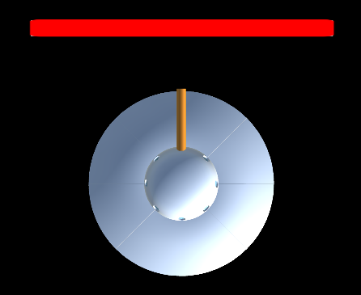
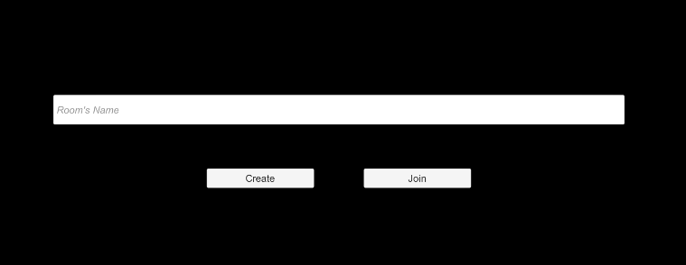

# Multiplayer AR Shooter v1.0

## Development Tools:

- Unity 2020.3.32f1
- Vuforia 10.5.5

## Description

This application is a multiplayer AR target-based game that consists in destroying the opponent shooting theirs.

Each player has an HP bar. If this bar runs out, the player is destroyed.

## Requirements to Play

- Android 6.0 (Marshmallow)
- Target (Available in the Docs folder)

## Setup

1. Download and print the Target image

2. Start the Application
3. Create or Join a room 

