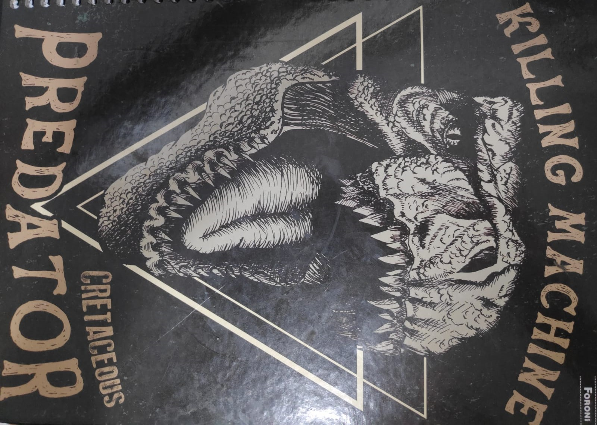

# Multiplayer AR Shooter v2.0

## Development Tools:

- Unity 2020.3.32f1
- Vuforia 10.5.5

## Description

This application is a multiplayer AR target-based game that consists in destroying the opponent shooting theirs.

Each player has an HP bar. If this bar runs out, the player is destroyed.

## Setup Project

1. Git Clone the latest version of the project (master)
2. Open the project and switch the plataform to Android

3. Enable the Mobile Input to allow mobile UI test on Editor

## Requirements to Play

- Android 6.0 (Marshmallow)
- Target (Available in the Docs folder)

## Setup to Play

1. Download and print the Target image

2. Start the Application

### Modes

- **Multiplayer**

    In this mode, you can create/join a room to play with other players online.

    

    When your ship is destroyed in this mode, you can choose to respawn in a random position or to leave the match.

    Every time you join a match, your ship acquires a random color to make you look different from the other players.

- **Single**

    In this mode, you play against a ship controlled by the computer.

    The match ends when you or the opponent is destroyed. 

    When the match ends you can choose to play again or to leave.

- **Training**

    This mode is to practice the player mechanics. 

    The objective is to destroy the cubes in the scene.

    The match ends when you destroy all the cubes. 

    When the match ends you can choose to play again or to leave.

## Credits

**Player/Agent Model**

"UFO" (https://skfb.ly/6X7H6) by rowan11 is licensed under Creative Commons Attribution (http://creativecommons.org/licenses/by/4.0/).